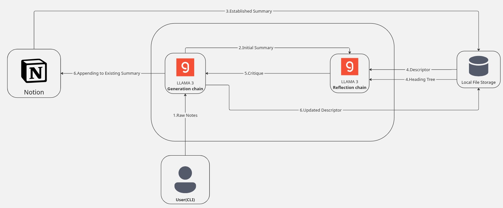
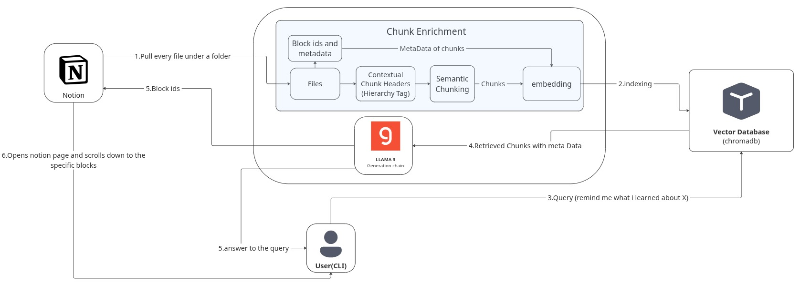
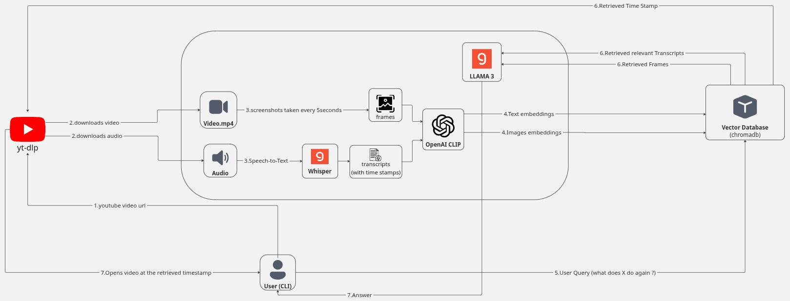

# Study Assistant


A modular CLI tool that helps you learn faster by automating note-taking, summarization, and knowledge retrieval.

## 🎥 Demo Videos

- [Progressive Summarizer](https://bachkhairi.github.io/study_assistant/demo_videos/summarizer.html)  
- [Knowledge Base Q&A](https://bachkhairi.github.io/study_assistant/demo_videos/KB_Qa.html)  
- [YouTube Q&A](https://bachkhairi.github.io/study_assistant/demo_videos/videoqa.html)  

## Table of Contents

- [Overview](#overview)
- [Features](#features)
- [Installation](#installation)
- [Core Components](#core-components)
  - [Progressive Summarizer](#progressive-summarizer)
  - [Knowledge Base Q&A](#knowledge-base-qa)
  - [YouTube Q&A](#youtube-qa)
- [Quick Start Guide](#quick-start-guide)
- [Commands Reference](#commands-reference)
- [Project Structure](#project-structure)

## Overview

Stop worrying about structuring notes while learning and focus on understanding, study_assistant handles the rest.

**The Problem:** Taking organized notes while reading articles, papers, or watching lectures breaks your flow and splits your attention.

**The Solution:** Feed your raw notes to study_assistant. It generates coherent summaries that integrate with your existing Notion workspace and provides powerful Q&A capabilities across all your knowledge.

## Features

- **Progressive Summarizer**: Converts messy notes into structured summaries in Notion
- **Knowledge Base Q&A**: Query your entire Notion workspace with precise block-level navigation
- **YouTube Q&A**: Ask questions about video content with timestamp navigation and visual context

## Installation

```bash
# Clone the repository
git clone https://github.com/yourusername/study_assistant.git
cd study_assistant

# Install dependencies
pip install -r requirements.txt

# Set up environment variables
nano .env
# Edit .env with your API keys:
# GROQ_API_KEY=your_groq_api_key
# NOTION_API_KEY=your_notion_api_key
# GROQ_MODEL_NAME=llama3-70b-8192
# Optional: NOTION_PAGE_ID, NOTION_FOLDER_ID

### Setting Up the CLI Executable
```


### Setting Up the CLI Executable

The top line in `study_assistant/cli/study_assistant` should be a general shebang to work on any system. Replace the local virtual environment path:

```bash
#!/usr/bin/env python3
```

To make `study_assistant` accessible globally from anywhere in your terminal:

1. **Make the script executable:**
   ```bash
   chmod +x /study_assistant/cli/study_assistant
   ```

2. **Add the script to your PATH** (add this to your `.bashrc` or `.zshrc`):
   ```bash
   export PATH="$PATH:~/study_assistant/cli"
   ```

3. **Reload your shell configuration:**
   ```bash
   source ~/.bashrc   # or source ~/.zshrc if using zsh
   ```

After this setup, you can run `study_assistant` from anywhere in your terminal.

## Core Components

### Progressive Summarizer



Transform your raw, unstructured notes into polished summaries that build upon your existing knowledge.

#### How It Works

1. **Generate**: Creates a draft summary using new notes and existing context
2. **Reflect**: Reviews the draft with descriptor and headings tree, providing a critique to guide refinement
3. **Update**: Produces an enhanced summary and updates context for future sessions

#### Key Concepts

**Descriptor**: A structured representation of your existing knowledge containing:
- Global topic summary
- Key bullet points of main ideas

**Example Descriptor:**
```
Global: Discusses limitations of foundation models, including data, trust, and output generation constraints.

- Describes data limitations: knowledge cutoffs, availability, and quality issues
- Highlights trust and transparency limitations: lack of source citation
- Explains probabilistic output generation: hallucinations and unwanted behaviors
```


#### Design Rationale:

I designed the system with the idea that the reflection chain needs a clear view of existing knowledge to integrate new notes effectively. 

**Descriptor**  
- Captures semantic integrity (core meaning and content)  
- *Example*: Key points, relationships, and context  

**Headings Tree**  
- Maintains structural integrity (organization hierarchy)  
- *Example*: Section nesting and logical flow  

They enable natural knowledge integration  and context-preserving updates.


#### Usage

```bash
# Create a new study session
study_assistant sessions create_session <session_name> <notion_page_id>

# List all sessions
study_assistant sessions list

# Add summary from your raw notes
study_assistant sessions add-summary --session <session_id> --file <notes_file.txt>

# View session history
study_assistant sessions get_history --session <session_id>
```

### Knowledge Base Q&A



Query your entire Notion workspace with pinpoint accuracy.

#### How It Works

1. **Index**: Pulls all pages from a Notion folder, including metadata and hierarchy
2. **Chunk**: Groups content under headings and semantically chunks long paragraphs
3. **Tag**: Each chunk receives a hierarchy tag (`Root Page → Subpage → Heading → Chunk`)
4. **Embed**: Chunks are embedded and stored with block/page IDs
5. **Retrieve**: Finds relevant chunks and determines the best answer
6. **Navigate**: Opens the exact Notion block and scrolls to the relevant content

#### Usage

```bash
# Create a new project
study_assistant query_pipeline create <project_title>

# Ask a question
study_assistant query_pipeline ask <query>
# You'll be prompted to select a project and provide the Notion folder ID
```

### YouTube Q&A



Get answers from video content with visual context and precise navigation.

#### How It Works

1. **Download**: Uses yt-dlp to download audio and video
2. **Transcribe**: Whisper generates timestamped transcripts
3. **Capture**: Takes screenshots every 5 seconds
4. **Embed**: OpenAI CLIP embeds both transcripts and images
5. **Query**: Retrieves 10 relevant transcript chunks and 3 images
6. **Answer**: LLM selects best timestamp and formulates structured response
7. **Navigate**: Opens video at exact timestamp with relevant screenshots

#### Usage

```bash
# Process and query a YouTube video
study_assistant videoqa run <youtube_url> --title <project_name> --query <your_question>

# Query previously processed video
study_assistant videoqa run <youtube_url> --title <existing_project_name> --query <new_question>
```

## Quick Start Guide

### 1. Set up your first study session

```bash
# Create a session linked to your Notion page
study_assistant sessions create_session "Machine Learning Notes" <notion_page_id>

# Add your first summary
echo "Neural networks use backpropagation to learn..." > my_notes.txt
study_assistant sessions add-summary --session <session_id> --file my_notes.txt
```

### 2. Query your knowledge base

```bash
# Create a project for your Notion workspace
study_assistant query_pipeline create "CS Knowledge Base"

# Ask questions about your notes
study_assistant query_pipeline ask "What is backpropagation?"
```

### 3. Learn from YouTube videos

```bash
# Ask questions about a lecture video
study_assistant videoqa run "https://youtube.com/watch?v=..." --title "ML_Lecture_1" --query "How does gradient descent work?"
```

## Commands Reference

### Session Management
```bash
study_assistant sessions create_session <name> <notion_page_id>
study_assistant sessions list
study_assistant sessions add-summary --session <id> --file <file>
study_assistant sessions get_history --session <id>
```

### Knowledge Base
```bash
study_assistant query_pipeline create <project_title>
study_assistant query_pipeline ask <query>
```

### YouTube Q&A
```bash
study_assistant videoqa run <url> --title <project_name> --query <query>
```

## Project Structure

```
study_assistant/
├── logs/                          # Session data
│   └── <session_id>/
│       ├── metadata.json          # Session info
│       ├── current.txt            # Current descriptor
│       ├── chathistory.json       # Conversation history
│       └── history/               # Previous descriptors
├── data/                          # Knowledge base projects
│   └── <project_name>/
│       ├── metadata.json
│       └── chunks.json
├── video_data/                    # YouTube processing
│   └── <project_name>/
│       ├── audio/
│       ├── video/
│       ├── screenshots/
│       └── transcripts/
├── chroma_db/                     # Vector embeddings
└── app/                          # Source code
```


---
